<!-- _class: title -->

# Advanced ONNX Optimization Techniques
## Week 2 - Session 2
### Deploying Edge AI
#### University of South Alabama

<!-- 
Speaker Notes:
- Welcome back to Week 2 of Deploying Edge AI
- In our last session, we explored model architecture optimization techniques
- Today we'll dive deep into ONNX Runtime's optimization capabilities
- These optimizations can dramatically improve performance without changing model architecture
- By the end of this session, you'll be able to create comprehensive optimization pipelines
- We'll see how ONNX-specific optimizations complement the techniques from Session 1
-->

---

<!-- _class: section -->

# ONNX Runtime Optimization Framework

<!-- 
Speaker Notes:
- ONNX Runtime is more than just an inference engine
- It includes a sophisticated optimization framework
- These optimizations happen automatically but can be controlled and customized
- Understanding how they work helps you maximize performance
- We'll explore the different optimization levels and their impact
-->

---

# ONNX Runtime Architecture

<div class="columns">
<div>

## Core Components
- **Graph Optimization Engine**
  - Pattern matching and rewriting
  - Operation fusion
  - Constant folding
  - Memory planning

- **Execution Providers**
  - CPUExecutionProvider (our focus)
  - CUDAExecutionProvider
  - TensorRTExecutionProvider
  - Custom providers

- **Memory Management**
  - Memory pool allocation
  - Buffer sharing
  - Cache optimization

</div>
<div>

## Optimization Pipeline

```mermaid
graph TD
    A[ONNX Model] --> B[Parser]
    B --> C[Graph Transformer]
    C --> D[Level 1: Basic]
    D --> E[Level 2: Extended]
    E --> F[Level 3: Layout]
    F --> G[Optimized Graph]
    G --> H[Execution Plan]
    H --> I[Runtime Inference]
    
    style C fill:#C61636
    style G fill:#00264C
```


</div>
</div>

<!-- 
Speaker Notes:
- ONNX Runtime's architecture is designed for optimization from the ground up
- The Graph Optimization Engine is the heart of the system:
  - Analyzes the computational graph for optimization opportunities
  - Applies transformations that preserve semantics but improve performance
  - Works at multiple levels of abstraction
- Execution Providers handle the actual computation:
  - CPUExecutionProvider is our focus for edge deployment
  - Includes optimized kernels for common operations
  - Can leverage SIMD instructions (AVX, NEON)
- Memory management is critical for edge devices:
  - Reduces allocation overhead through pooling
  - Shares buffers between operations when possible
  - Optimizes cache usage patterns
- The optimization pipeline is multi-stage:
  - Each level applies increasingly aggressive optimizations
  - Higher levels may require more analysis time
  - Can be controlled through session options
- Understanding this architecture helps predict optimization behavior
-->

---

# Optimization Levels Explained

<div class="highlight-box">

## Three Levels of Graph Optimization

### Level 1: Basic Optimizations (Default)
- **Constant Folding**: Pre-compute constant expressions
- **Redundant Node Elimination**: Remove unnecessary operations
- **Common Subexpression Elimination**: Reuse computed values
- **Fast**: Minimal overhead, always beneficial

### Level 2: Extended Optimizations
- **Advanced Fusion**: Conv+BatchNorm+Activation patterns
- **GEMM Optimizations**: Matrix multiplication improvements
- **Transformer Optimizations**: Attention fusion for BERT/GPT
- **Moderate Speed**: Small compilation overhead

### Level 3: Layout Optimizations
- **Memory Layout Transformation**: NCHW ↔ NHWC conversions
- **Aggressive Fusion**: Cross-operation optimizations
- **Hardware-Specific**: Tuned for target platform
- **Slower**: Significant analysis time, best for production

</div>

<!-- 
Speaker Notes:
- ONNX Runtime provides three optimization levels with different tradeoffs
- Level 1 (Basic) optimizations are always recommended:
  - Constant folding pre-computes operations on constants
  - Eliminates operations that don't affect output
  - Reuses intermediate results when possible
  - Virtually no overhead, significant benefits
- Level 2 (Extended) adds more sophisticated optimizations:
  - Fuses common patterns like Conv+BN+ReLU into single operations
  - Optimizes matrix multiplications for CPU cache
  - Special optimizations for transformer architectures
  - Small compilation overhead but usually worth it
- Level 3 (Layout) includes aggressive transformations:
  - May reorder data layout for better memory access
  - Platform-specific optimizations
  - Can have significant compilation time
  - Best used when model won't change frequently
- Choosing the right level:
  - Development: Level 1 for fast iteration
  - Testing: Level 2 for good balance
  - Production: Level 3 for maximum performance
- Can be set per session based on requirements
-->

---

# Configuring Optimization Levels

```python
import onnxruntime as ort
import numpy as np
import time

def benchmark_optimization_levels(model_path, input_shape, num_runs=100):
    """Compare performance across optimization levels"""
    results = {}
    
    # Test data
    input_data = np.random.randn(*input_shape).astype(np.float32)
    
    for opt_level in [1, 2, 99]:  # 99 = Level 3
        # Configure session options
        sess_options = ort.SessionOptions()
        sess_options.graph_optimization_level = getattr(
            ort.GraphOptimizationLevel, 
            {1: 'ORT_ENABLE_BASIC',
             2: 'ORT_ENABLE_EXTENDED', 
             99: 'ORT_ENABLE_ALL'}[opt_level]
        )
        
        # Measure session creation time
        start_create = time.time()
        session = ort.InferenceSession(model_path, sess_options)
        create_time = time.time() - start_create
        
        input_name = session.get_inputs()[0].name
        
        # Warmup
        for _ in range(10):
            session.run(None, {input_name: input_data})
        
        # Benchmark inference
        start_infer = time.time()
        for _ in range(num_runs):
            session.run(None, {input_name: input_data})
        infer_time = (time.time() - start_infer) / num_runs * 1000
        
        results[f'Level_{opt_level}'] = {
            'creation_time_s': create_time,
            'inference_time_ms': infer_time,
            'total_time_ms': create_time * 1000 + infer_time * num_runs
        }
    
    return results
```

<!-- 
Speaker Notes:
- This code demonstrates how to configure and benchmark optimization levels
- Key implementation details:
  - GraphOptimizationLevel enum controls optimization aggressiveness
  - Session creation time increases with optimization level
  - Inference time typically decreases with higher optimization
- Important considerations:
  - Creation time matters for models loaded frequently
  - For long-running services, creation overhead is amortized
  - Level 3 (ORT_ENABLE_ALL) can take several seconds for large models
- Benchmarking best practices shown:
  - Always include warmup runs
  - Measure both creation and inference time
  - Consider total time based on usage pattern
- Real-world guidance:
  - Mobile apps: May prefer Level 1-2 for faster startup
  - Servers: Level 3 for maximum throughput
  - Edge devices: Balance based on model reload frequency
- The results help make informed optimization decisions
  - Plot creation vs inference tradeoffs
  - Choose based on deployment scenario
  - Document the choice in your optimization pipeline
-->

---

# Graph-Level Optimizations

<div class="alert-box">

## Key Graph Transformations

### Operation Fusion
```python
# Before fusion:
Conv2D → BatchNorm → ReLU → Add

# After fusion:
FusedConvBnReLuAdd (single optimized kernel)
```

### Constant Propagation
```python
# Before:
Input → Multiply(2.0) → Add(1.0) → Multiply(0.5)

# After:
Input → Multiply(1.0) → Add(0.5)
```

### Shape Inference & Optimization
```python
# Eliminates unnecessary reshapes and transposes
# Propagates shape information for better optimization
```

</div>

<!-- 
Speaker Notes:
- Graph-level optimizations transform the entire computational graph
- Operation fusion is one of the most impactful optimizations:
  - Combines multiple operations into single kernels
  - Reduces memory bandwidth requirements
  - Eliminates intermediate tensor materialization
  - Common patterns like Conv+BN+ReLU are prime targets
- Constant propagation simplifies the graph:
  - Pre-computes operations on constants
  - Chains of operations can often be reduced
  - Particularly effective after quantization
- Shape inference enables further optimizations:
  - Removes redundant shape operations
  - Enables better memory planning
  - Allows operation-specific optimizations
- Other important graph optimizations include:
  - Dead code elimination
  - Common subexpression elimination
  - Memory layout optimization
  - Algebraic simplifications
- These optimizations work together synergistically
- The order of application matters and is carefully designed
- Understanding these helps predict optimization effectiveness
-->

---

# Custom Graph Optimization

```python
import onnx
from onnx import helper, numpy_helper
import onnxruntime as ort

class CustomGraphOptimizer:
    """Example custom optimization: Fuse specific patterns"""
    
    def __init__(self, model_path):
        self.model = onnx.load(model_path)
        
    def find_pattern(self, pattern_ops):
        """Find sequences of operations matching pattern"""
        matches = []
        nodes = self.model.graph.node
        
        for i in range(len(nodes) - len(pattern_ops) + 1):
            if all(nodes[i+j].op_type == op for j, op in enumerate(pattern_ops)):
                matches.append(i)
        
        return matches
    
    def fuse_gelu_pattern(self):
        """Fuse GELU activation pattern into single op"""
        # GELU pattern: 0.5 * x * (1 + tanh(sqrt(2/pi) * (x + 0.044715 * x^3)))
        # Often split into multiple ops, can be fused
        
        gelu_patterns = self.find_pattern(['Mul', 'Add', 'Tanh', 'Mul', 'Mul'])
        
        for idx in gelu_patterns:
            # Create fused GELU node
            fused_node = helper.make_node(
                'Gelu',  # Custom op or optimized implementation
                inputs=[self.model.graph.node[idx].input[0]],
                outputs=[self.model.graph.node[idx + 4].output[0]],
                name=f'FusedGelu_{idx}'
            )
            
            # Replace pattern with fused node
            # (Implementation details omitted for brevity)
            
    def optimize_model(self):
        """Apply custom optimizations"""
        self.fuse_gelu_pattern()
        # Add other custom optimizations
        
        # Validate optimized model
        onnx.checker.check_model(self.model)
        
        return self.model

# Usage
optimizer = CustomGraphOptimizer("model.onnx")
optimized_model = optimizer.optimize_model()
onnx.save(optimized_model, "model_custom_optimized.onnx")
```

<!-- 
Speaker Notes:
- Sometimes you need custom optimizations beyond what ONNX Runtime provides
- Custom graph optimization allows domain-specific improvements
- The example shows fusing a GELU activation pattern:
  - GELU is common in transformers but may be split into basic ops
  - Fusing into single operation improves performance
  - Pattern matching identifies optimization opportunities
- Key steps in custom optimization:
  1. Load and analyze the graph structure
  2. Identify patterns that can be optimized
  3. Create replacement nodes or subgraphs
  4. Validate the transformed model
- Common custom optimization targets:
  - Domain-specific activation functions
  - Model-specific patterns
  - Hardware-specific transformations
  - Quantization-aware patterns
- Best practices:
  - Always validate transformed models
  - Test numerical equivalence
  - Benchmark improvements
  - Document custom optimizations
- When to use custom optimization:
  - ONNX Runtime doesn't optimize your specific pattern
  - You have domain knowledge about the model
  - Hardware-specific optimizations needed
-->

---

<!-- _class: section -->

# Advanced Quantization with ONNX

<!-- 
Speaker Notes:
- Building on the quantization fundamentals from Session 1
- ONNX Runtime provides sophisticated quantization capabilities
- We'll explore both static and dynamic quantization approaches
- Focus on practical implementation and optimization strategies
-->

---

# ONNX Quantization Architecture

<div class="columns">
<div>

## Quantization Components
- **Quantization Nodes**
  - QuantizeLinear
  - DequantizeLinear
  - QLinearConv
  - QLinearMatMul

- **Quantization Schemes**
  - Symmetric vs Asymmetric
  - Per-tensor vs Per-channel
  - Static vs Dynamic
  - Mixed precision

- **Calibration Methods**
  - MinMax
  - Entropy
  - Percentile
  - KL-Divergence

</div>
<div>

## Quantization Flow
```python
# ONNX Runtime Quantization API
from onnxruntime.quantization import (
    quantize_static,
    quantize_dynamic,
    QuantType,
    CalibrationDataReader
)

class CalibrationReader(CalibrationDataReader):
    def __init__(self, data_generator):
        self.data = data_generator
        self.batch_id = 0
        
    def get_next(self):
        if self.batch_id < len(self.data):
            batch = self.data[self.batch_id]
            self.batch_id += 1
            return {'input': batch}
        return None
    
    def rewind(self):
        self.batch_id = 0

# Static quantization with calibration
calibration_reader = CalibrationReader(
    calibration_data_generator
)

quantize_static(
    model_input='model.onnx',
    model_output='model_int8.onnx',
    calibration_data_reader=calibration_reader,
    quant_format=QuantFormat.QDQ,
    per_channel=True,
    weight_type=QuantType.QInt8
)
```

</div>
</div>

<!-- 
Speaker Notes:
- ONNX Runtime's quantization is built into the graph structure
- Quantization nodes are explicit in the graph:
  - QuantizeLinear converts FP32 to INT8
  - DequantizeLinear converts back to FP32
  - QLinear operations work directly on quantized values
- Different quantization schemes offer tradeoffs:
  - Symmetric: Simpler, zero point = 0
  - Asymmetric: Better range utilization
  - Per-channel: Better accuracy for convolutions
  - Per-tensor: Simpler, less overhead
- Calibration is crucial for static quantization:
  - MinMax: Simple, uses value range
  - Entropy: Minimizes information loss
  - Percentile: Robust to outliers
  - KL-Divergence: Balances range and precision
- The CalibrationDataReader interface:
  - Provides data for calibration
  - Should use representative samples
  - Typically 100-1000 samples sufficient
- QDQ (Quantize-Dequantize) format:
  - More flexible than QOperator format
  - Better for mixed precision
  - Easier to analyze and debug
-->

---

# Static vs Dynamic Quantization

<div class="highlight-box">

## Comparison and Use Cases

### Static Quantization
```python
# Pre-calibrated, fixed scale/zero-point
def apply_static_quantization(model_path, calibration_data):
    quantize_static(
        model_input=model_path,
        model_output='model_static_int8.onnx',
        calibration_data_reader=CalibrationReader(calibration_data),
        per_channel=True,
        reduce_range=True,  # Better accuracy on some CPUs
        weight_type=QuantType.QInt8,
        activation_type=QuantType.QUInt8,
        optimize_model=True  # Apply graph optimizations first
    )
```

### Dynamic Quantization
```python
# Compute scale/zero-point at runtime
def apply_dynamic_quantization(model_path):
    quantize_dynamic(
        model_input=model_path,
        model_output='model_dynamic_int8.onnx',
        weight_type=QuantType.QInt8,
        per_channel=True,
        reduce_range=True,
        extra_options={'ActivationSymmetric': True}
    )
```

### When to Use Each
- **Static**: Known input distribution, maximum performance
- **Dynamic**: Variable inputs, simpler deployment

</div>

<!-- 
Speaker Notes:
- Static and dynamic quantization serve different use cases
- Static quantization characteristics:
  - Requires calibration data
  - Fixed quantization parameters
  - Fastest inference (no runtime calculation)
  - Best when input distribution is known and stable
  - Ideal for production deployments
- Dynamic quantization characteristics:
  - No calibration needed
  - Computes parameters per batch
  - Small runtime overhead
  - Adapts to input distribution
  - Good for models with varying inputs
- Key differences in implementation:
  - Static needs representative calibration data
  - Dynamic only quantizes weights statically
  - Static typically gives better performance
  - Dynamic is more flexible
- Advanced options:
  - reduce_range: Uses 7-bit for better accuracy
  - per_channel: Different scales per conv channel
  - ActivationSymmetric: Forces symmetric quantization
- Selection criteria:
  - Deployment constraints
  - Input variability
  - Accuracy requirements
  - Development time
- Can also use hybrid approaches for different layers
-->

---

# Advanced Calibration Techniques

```python
import numpy as np
from onnxruntime.quantization import CalibrationDataReader, quantize_static
from onnxruntime.quantization.calibrate import CalibrationMethod

class AdvancedCalibrationReader(CalibrationDataReader):
    """Enhanced calibration with data augmentation"""
    
    def __init__(self, dataset, augment=True, num_augmentations=3):
        self.dataset = dataset
        self.augment = augment
        self.num_augmentations = num_augmentations
        self.current_idx = 0
        self.augment_idx = 0
        
    def get_next(self):
        if self.current_idx >= len(self.dataset):
            return None
            
        batch = self.dataset[self.current_idx]
        
        if self.augment and self.augment_idx < self.num_augmentations:
            # Apply augmentation for better calibration coverage
            batch = self.augment_batch(batch, self.augment_idx)
            self.augment_idx += 1
        else:
            self.augment_idx = 0
            self.current_idx += 1
            
        return {'input': batch}
    
    def augment_batch(self, batch, aug_idx):
        """Apply different augmentations for robust calibration"""
        if aug_idx == 0:
            # Original
            return batch
        elif aug_idx == 1:
            # Add noise
            noise = np.random.normal(0, 0.01, batch.shape)
            return batch + noise
        elif aug_idx == 2:
            # Slight scaling
            scale = np.random.uniform(0.95, 1.05)
            return batch * scale
            
    def rewind(self):
        self.current_idx = 0
        self.augment_idx = 0

# Advanced quantization with multiple calibration methods
def compare_calibration_methods(model_path, calibration_data):
    methods = {
        'MinMax': CalibrationMethod.MinMax,
        'Entropy': CalibrationMethod.Entropy,
        'Percentile': CalibrationMethod.Percentile,
    }
    
    results = {}
    for name, method in methods.items():
        output_path = f'model_{name.lower()}_quantized.onnx'
        
        quantize_static(
            model_input=model_path,
            model_output=output_path,
            calibration_data_reader=AdvancedCalibrationReader(calibration_data),
            calibration_method=method,
            extra_options={
                'CalibTensorRangeSymmetric': True,
                'CalibMovingAverage': True,
                'CalibMovingAverageConstant': 0.95
            }
        )
        
        # Evaluate quantized model
        results[name] = evaluate_quantized_model(output_path)
    
    return results
```

<!-- 
Speaker Notes:
- Advanced calibration can significantly improve quantization quality
- Data augmentation during calibration:
  - Helps capture input variability
  - Improves robustness to input variations
  - Particularly important for edge deployment
  - Simple augmentations often sufficient
- Different calibration methods have different strengths:
  - MinMax: Fast, works well for uniform distributions
  - Entropy: Minimizes information loss, good for accuracy
  - Percentile: Robust to outliers, good for real-world data
  - KL-Divergence: Balances range coverage and precision
- Advanced calibration options:
  - CalibTensorRangeSymmetric: Forces symmetric ranges
  - CalibMovingAverage: Smooths calibration statistics
  - CalibMovingAverageConstant: Controls smoothing (0.9-0.99)
- Best practices for calibration:
  - Use representative data covering edge cases
  - Include difficult examples
  - Validate on separate test set
  - Compare multiple methods
- Calibration dataset size:
  - 100-1000 samples usually sufficient
  - More samples for high variability
  - Diminishing returns beyond 1000
- Monitor calibration quality through test metrics
-->

---

# Mixed Precision Strategies

<div class="alert-box">

## Selective Quantization for Optimal Performance

```python
from onnxruntime.quantization import quantize_static

class MixedPrecisionQuantizer:
    """Apply different quantization to different parts of model"""
    
    def __init__(self, model_path):
        self.model = onnx.load(model_path)
        self.sensitivity_map = {}
        
    def analyze_layer_sensitivity(self, calibration_data, test_data):
        """Determine which layers are sensitive to quantization"""
        baseline_accuracy = self.evaluate_model(self.model, test_data)
        
        for node in self.model.graph.node:
            if node.op_type in ['Conv', 'MatMul', 'Gemm']:
                # Temporarily quantize this layer only
                quantized_model = self.quantize_single_layer(node.name)
                accuracy = self.evaluate_model(quantized_model, test_data)
                
                sensitivity = baseline_accuracy - accuracy
                self.sensitivity_map[node.name] = sensitivity
                
        return self.sensitivity_map
    
    def create_mixed_precision_model(self, sensitivity_threshold=0.01):
        """Keep sensitive layers in FP32, quantize others"""
        
        # Nodes to exclude from quantization
        exclude_nodes = [
            name for name, sensitivity in self.sensitivity_map.items()
            if sensitivity > sensitivity_threshold
        ]
        
        # Add first and last layers (often sensitive)
        exclude_nodes.extend(self.get_first_last_layers())
        
        # Apply selective quantization
        quantize_static(
            model_input=self.model,
            model_output='model_mixed_precision.onnx',
            calibration_data_reader=self.calibration_reader,
            per_channel=True,
            nodes_to_exclude=exclude_nodes,
            extra_options={
                'ActivationSymmetric': False,
                'WeightSymmetric': True,
                'EnableSubgraph': True
            }
        )
        
    def get_first_last_layers(self):
        """Identify input and output layers"""
        first_layers = []
        last_layers = []
        
        # Logic to find first/last computational layers
        # (Implementation depends on model structure)
        
        return first_layers + last_layers
```

</div>

<!-- 
Speaker Notes:
- Mixed precision quantization balances accuracy and performance
- Not all layers respond equally to quantization:
  - First/last layers often most sensitive
  - Attention mechanisms need careful handling
  - Depthwise convolutions may need higher precision
  - Batch normalization parameters often stay FP32
- Layer sensitivity analysis is crucial:
  - Quantize one layer at a time
  - Measure accuracy impact
  - Build sensitivity map
  - Use threshold to decide quantization
- Implementation strategies:
  - Exclude sensitive nodes from quantization
  - Use different bit widths for different layers
  - Keep critical paths in higher precision
  - Quantize bulk of computation
- Advanced mixed precision options:
  - INT8 for most layers, INT16 for sensitive
  - FP16 for extremely sensitive operations
  - Dynamic quantization for variable layers
  - Per-channel for convolutions, per-tensor for FC
- Practical guidelines:
  - Start conservative, increase aggressiveness
  - Monitor accuracy continuously
  - 90% of benefit from quantizing 90% of ops
  - Focus on computational bottlenecks
- This approach often achieves near-FP32 accuracy with INT8 speed
-->

---

<!-- _class: section -->

# Operator Fusion and Memory Optimization

<!-- 
Speaker Notes:
- Operator fusion and memory optimization are crucial for edge performance
- These techniques reduce memory bandwidth requirements
- Particularly important for memory-constrained edge devices
- We'll explore both automatic and custom fusion strategies
-->

---

# Understanding Operator Fusion

<div class="columns">
<div>

## Why Fusion Matters
- **Memory Bandwidth**
  - Biggest bottleneck on edge devices
  - Fusion reduces intermediate tensors
  - Keeps data in cache

- **Kernel Launch Overhead**
  - Each op has overhead
  - Fusion amortizes cost
  - Critical for small tensors

- **Optimization Opportunities**
  - Algebraic simplifications
  - Shared computations
  - Better vectorization

</div>
<div>

## Common Fusion Patterns
```python
# Pattern 1: Conv + BatchNorm + ReLU
# Before: 3 kernels, 2 intermediate tensors
x = conv2d(input, weight, bias)
x = batch_norm(x, mean, var, gamma, beta)
x = relu(x)

# After: 1 fused kernel
x = fused_conv_bn_relu(input, weight, 
                      bias, mean, var, 
                      gamma, beta)

# Pattern 2: Transformer attention
# Before: Multiple MatMul + Add + Softmax
Q = matmul(x, W_q) + b_q
K = matmul(x, W_k) + b_k
V = matmul(x, W_v) + b_v
scores = matmul(Q, K.T) / sqrt(d)
weights = softmax(scores)
output = matmul(weights, V)

# After: Fused attention kernel
output = fused_attention(x, W_qkv, b_qkv)
```

</div>
</div>

<!-- 
Speaker Notes:
- Operator fusion is one of the most impactful optimizations
- Memory bandwidth is often the limiting factor:
  - Modern CPUs can compute faster than memory can feed data
  - Each intermediate tensor requires memory read/write
  - Fusion keeps values in registers/cache
- Kernel launch overhead matters for edge:
  - Each operation has setup cost
  - Significant for small tensors
  - Fusion dramatically reduces total overhead
- Common fusion patterns in ONNX Runtime:
  - Conv+BN+Activation: Universal in CNNs
  - MatMul+Add+Activation: Common in transformers
  - Normalization sequences: LayerNorm, InstanceNorm
  - Elementwise sequences: Add+Mul+Add
- The examples show typical improvements:
  - Conv+BN+ReLU: 3x memory bandwidth reduction
  - Attention: Can be 10x faster when fused
- Fusion also enables better optimization:
  - Compiler can optimize across operations
  - Shared memory access patterns
  - Better instruction scheduling
-->

---

# ONNX Runtime Fusion Capabilities

<div class="highlight-box">

## Built-in Fusion Patterns

```python
import onnxruntime as ort
from onnxruntime.transformers import optimizer

# Enable transformer-specific fusions
def optimize_transformer_model(model_path, model_type='bert'):
    """Apply transformer-specific optimizations"""
    
    # Create optimizer with model-specific settings
    model_optimizer = optimizer.optimize_model(
        model_path,
        model_type=model_type,  # 'bert', 'gpt2', 'bart', etc.
        num_heads=12,           # Model-specific
        hidden_size=768,        # Model-specific
        optimization_options=optimizer.FusionOptions(
            'all'  # Enable all fusions
        ),
        opt_level=2,
        use_gpu=False,  # CPU optimizations
        only_onnxruntime=True
    )
    
    # Save optimized model
    model_optimizer.save_model_to_file('model_fused.onnx')
    
    # Get optimization statistics
    print(f"Fused operators: {model_optimizer.get_fused_operator_statistics()}")
    
    return model_optimizer

# Check what fusions were applied
def analyze_fusions(original_model, optimized_model):
    """Compare models to see fusion impact"""
    
    original_ops = count_operations(original_model)
    optimized_ops = count_operations(optimized_model)
    
    print("Operation count changes:")
    for op_type in set(original_ops.keys()) | set(optimized_ops.keys()):
        orig_count = original_ops.get(op_type, 0)
        opt_count = optimized_ops.get(op_type, 0)
        if orig_count != opt_count:
            print(f"  {op_type}: {orig_count} → {opt_count}")
```

</div>

<!-- 
Speaker Notes:
- ONNX Runtime includes sophisticated fusion capabilities
- Transformer-specific optimizations are particularly powerful:
  - Attention fusion: Combines Q,K,V projections and attention
  - LayerNorm fusion: Merges normalization with adjacent ops
  - Gelu/FastGelu fusion: Optimizes activation functions
  - SkipLayerNorm: Fuses residual connections
- The optimizer detects and applies fusions automatically:
  - Analyzes model structure
  - Identifies fusion opportunities
  - Validates correctness
  - Applies transformations
- Different model types have specific optimizations:
  - BERT: Attention, LayerNorm, Gelu fusions
  - GPT-2: Similar plus causal attention
  - T5: Encoder-decoder specific patterns
  - Custom models: May need manual fusion
- Fusion statistics help understand impact:
  - Number of operations reduced
  - Memory savings estimates
  - Performance improvement potential
- Important settings:
  - opt_level controls aggressiveness
  - use_gpu=False ensures CPU-specific optimizations
  - only_onnxruntime avoids external dependencies
- Always validate fused models maintain accuracy
-->

---

# Custom Operator Implementation

```python
import numpy as np
from onnxruntime import InferenceSession
import onnx
from onnx import helper, TensorProto

class CustomOperatorBuilder:
    """Create and register custom fused operators"""
    
    @staticmethod
    def create_fused_swish_op():
        """Create custom Swish activation (x * sigmoid(x))"""
        
        # Define the custom operator schema
        op_schema = helper.make_node(
            'FusedSwish',           # Custom op name
            inputs=['X'],           # Input tensor
            outputs=['Y'],          # Output tensor
            domain='custom.ops',    # Custom domain
            name='swish_activation'
        )
        
        # Implementation for CPU execution
        def swish_cpu_kernel(x):
            """Optimized Swish implementation"""
            # Using approximation for faster sigmoid
            # sigmoid(x) ≈ 0.5 * (1 + tanh(0.5 * x))
            return x * (0.5 * (1.0 + np.tanh(0.5 * x)))
        
        return op_schema, swish_cpu_kernel
    
    @staticmethod
    def register_custom_ops_in_session():
        """Register custom operators with ONNX Runtime"""
        
        # Session options with custom op library
        import onnxruntime as ort
        
        sess_options = ort.SessionOptions()
        
        # For C++ custom ops (compiled separately)
        # sess_options.register_custom_ops_library('custom_ops.so')
        
        # For Python custom ops (development/prototyping)
        # Note: Python custom ops are slower than C++
        providers = [
            ('CPUExecutionProvider', {
                'custom_ops': {
                    'FusedSwish': lambda x: x * (1 / (1 + np.exp(-x)))
                }
            })
        ]
        
        return sess_options, providers

# Example: Fusing a complex pattern
def fuse_grouped_convolution_pattern(model):
    """Fuse grouped convolution + concat pattern"""
    
    # Pattern: Multiple parallel convs concatenated
    # Common in models like InceptionNet, EfficientNet
    
    graph = model.graph
    nodes_to_remove = []
    
    # Find concat nodes
    for node in graph.node:
        if node.op_type == 'Concat':
            # Check if inputs are all Conv nodes
            input_convs = []
            for input_name in node.input:
                conv_node = find_node_by_output(graph, input_name)
                if conv_node and conv_node.op_type == 'Conv':
                    input_convs.append(conv_node)
            
            if len(input_convs) == len(node.input):
                # Can fuse into GroupedConvolution
                fused_node = create_grouped_conv(input_convs, node)
                graph.node.append(fused_node)
                nodes_to_remove.extend(input_convs + [node])
    
    # Remove original nodes
    for node in nodes_to_remove:
        graph.node.remove(node)
    
    return model
```

<!-- 
Speaker Notes:
- Custom operators enable domain-specific optimizations
- Use cases for custom operators:
  - Fusing complex patterns not recognized by ONNX Runtime
  - Hardware-specific optimizations
  - Novel architectures with unique operations
  - Performance-critical paths
- Implementation approaches:
  - Python: Good for prototyping, slower execution
  - C++: Production performance, more complex
  - Can start with Python, move to C++ if beneficial
- The Swish example shows a simple custom activation:
  - Common in modern architectures
  - Can be optimized with approximations
  - Fusing prevents intermediate tensor
- Grouped convolution fusion is more complex:
  - Identifies parallel convolution patterns
  - Combines into single efficient operation
  - Common in inception-style architectures
- Best practices:
  - Validate numerical accuracy
  - Benchmark against unfused version
  - Consider maintenance burden
  - Document custom operations well
- When to create custom ops:
  - Repeated patterns taking significant time
  - ONNX Runtime doesn't recognize the pattern
  - Hardware-specific optimization opportunity
  - Clear performance benefit justifies complexity
-->

---

# Memory Access Optimization

<div class="alert-box">

## CPU Memory Optimization Strategies

### 1. Data Layout Optimization
```python
# NCHW vs NHWC layout for convolutions
def optimize_layout_for_cpu(model_path):
    """Convert model to CPU-friendly layout"""
    
    sess_options = ort.SessionOptions()
    
    # Enable NHWC layout for better cache utilization
    sess_options.add_session_config_entry(
        "session.set_denormal_as_zero", "1"
    )
    sess_options.add_session_config_entry(
        "session.enable_cpu_mem_arena", "1"
    )
    
    # Graph optimization for layout
    sess_options.graph_optimization_level = \
        ort.GraphOptimizationLevel.ORT_ENABLE_ALL
    
    # Enable layout transformation
    providers = [
        ('CPUExecutionProvider', {
            'arena_extend_strategy': 'kSameAsRequested',
            'enable_cpu_mem_arena': True,
            'cpu_memory_layout': 'NHWC'  # Better for CPU
        })
    ]
    
    return sess_options, providers
```

### 2. Memory Pool Configuration
```python
# Configure memory allocation strategy
sess_options.add_session_config_entry(
    "memory.enable_memory_arena_shrinkage", "1"
)
sess_options.add_session_config_entry(
    "arena_extend_strategy", "1"  # kSameAsRequested
)
```

### 3. Inplace Operations
```python
# Enable inplace updates where possible
sess_options.add_session_config_entry(
    "session.enable_mem_reuse", "1"
)
```

</div>

<!-- 
Speaker Notes:
- Memory access patterns critically impact CPU performance
- Data layout optimization:
  - NCHW (channels first) vs NHWC (channels last)
  - CPU caches work better with NHWC for convolutions
  - Reduces cache misses and improves vectorization
  - ONNX Runtime can transform layouts automatically
- Memory pool configuration:
  - Reduces allocation overhead
  - Reuses memory buffers across operations
  - Arena allocator minimizes fragmentation
  - Critical for embedded systems
- Inplace operations:
  - Modify tensors directly instead of creating new ones
  - Reduces memory footprint
  - Improves cache utilization
  - Particularly effective for element-wise ops
- Additional optimizations:
  - Tensor memory alignment for SIMD
  - Prefetching strategies
  - Working set minimization
  - Cache-aware blocking
- Platform-specific considerations:
  - x86: Optimize for AVX/AVX2/AVX512
  - ARM: Optimize for NEON instructions
  - Consider cache sizes (L1/L2/L3)
  - Thread affinity and NUMA awareness
- Measurement is crucial:
  - Use performance counters
  - Monitor cache misses
  - Track memory bandwidth
  - Profile hot spots
-->

---

<!-- _class: section -->

# ONNX Runtime Profiling and Analysis

<!-- 
Speaker Notes:
- Profiling is essential for understanding optimization impact
- ONNX Runtime provides detailed profiling capabilities
- We'll explore how to use profiling to guide optimization
- This forms the feedback loop for continuous improvement
-->

---

# Advanced Profiling Techniques

<div class="columns">
<div>

## Profiling Configuration
```python
import onnxruntime as ort
import json
import pandas as pd

class AdvancedProfiler:
    def __init__(self, model_path):
        self.model_path = model_path
        self.setup_profiling()
        
    def setup_profiling(self):
        """Configure detailed profiling"""
        self.sess_options = ort.SessionOptions()
        
        # Enable profiling
        self.sess_options.enable_profiling = True
        
        # Detailed profiling settings
        self.sess_options.add_session_config_entry(
            "session.profiling_level", "all"
        )
        self.sess_options.add_session_config_entry(
            "session.enable_profiling", "1"
        )
        
        # Set optimization level
        self.sess_options.graph_optimization_level = \
            ort.GraphOptimizationLevel.ORT_ENABLE_ALL
    
    def profile_model(self, input_data, 
                     num_runs=100):
        """Run profiling session"""
        session = ort.InferenceSession(
            self.model_path, 
            self.sess_options
        )
        
        input_name = session.get_inputs()[0].name
        
        # Warmup
        for _ in range(10):
            session.run(None, {input_name: input_data})
        
        # Profile runs
        for _ in range(num_runs):
            session.run(None, {input_name: input_data})
        
        # Get profiling results
        prof_file = session.end_profiling()
        
        return self.parse_profiling_results(prof_file)
```

</div>
<div>

## Analyzing Results
```python
def parse_profiling_results(self, prof_file):
    """Extract insights from profiling data"""
    
    with open(prof_file, 'r') as f:
        prof_data = json.load(f)
    
    # Organize by operation type
    op_stats = {}
    
    for event in prof_data:
        if 'op_name' in event:
            op_type = event['op_name']
            if op_type not in op_stats:
                op_stats[op_type] = {
                    'count': 0,
                    'total_time': 0,
                    'instances': []
                }
            
            duration = event['dur']
            op_stats[op_type]['count'] += 1
            op_stats[op_type]['total_time'] += duration
            op_stats[op_type]['instances'].append({
                'name': event.get('name', ''),
                'duration': duration,
                'args': event.get('args', {})
            })
    
    # Create summary DataFrame
    summary_data = []
    for op_type, stats in op_stats.items():
        summary_data.append({
            'Operation': op_type,
            'Count': stats['count'],
            'Total Time (μs)': stats['total_time'],
            'Avg Time (μs)': stats['total_time'] / stats['count'],
            '% of Total': 0  # Calculate after
        })
    
    df = pd.DataFrame(summary_data)
    total_time = df['Total Time (μs)'].sum()
    df['% of Total'] = df['Total Time (μs)'] / total_time * 100
    
    return df.sort_values('Total Time (μs)', ascending=False)
```

</div>
</div>

<!-- 
Speaker Notes:
- Advanced profiling reveals optimization opportunities
- Configuration options provide different levels of detail:
  - Basic: Operation times only
  - Detailed: Include memory allocations
  - All: Complete execution trace
- The profiler captures:
  - Operation execution times
  - Memory allocation/deallocation
  - Kernel launch overhead
  - Data transfer times
- Parsing profiling results:
  - Group by operation type
  - Calculate aggregate statistics
  - Identify bottlenecks
  - Find optimization targets
- Key metrics to analyze:
  - Total time per operation type
  - Average time per instance
  - Percentage of total runtime
  - Memory allocation patterns
- Common findings:
  - Convolutions dominating runtime
  - Unexpected memory copies
  - Inefficient layouts
  - Unfused operations
- Use profiling to guide optimization:
  - Focus on top time consumers
  - Look for fusion opportunities
  - Identify memory bottlenecks
  - Validate optimization impact
- Profiling overhead is minimal but non-zero
-->

---

# Performance Bottleneck Analysis

<div class="highlight-box">

## Identifying and Addressing Bottlenecks

```python
class BottleneckAnalyzer:
    def __init__(self, profiling_df):
        self.prof_data = profiling_df
        
    def find_optimization_opportunities(self):
        """Identify specific optimization targets"""
        opportunities = []
        
        # 1. Unfused patterns
        unfused = self.find_unfused_patterns()
        if unfused:
            opportunities.append({
                'type': 'fusion',
                'patterns': unfused,
                'estimated_speedup': '2-3x'
            })
        
        # 2. Memory bottlenecks
        memory_bound = self.find_memory_bound_ops()
        if memory_bound:
            opportunities.append({
                'type': 'memory',
                'operations': memory_bound,
                'suggestion': 'Consider layout optimization'
            })
        
        # 3. Quantization candidates
        quant_candidates = self.find_quantization_targets()
        if quant_candidates:
            opportunities.append({
                'type': 'quantization',
                'layers': quant_candidates,
                'estimated_speedup': '2-4x'
            })
        
        return opportunities
    
    def find_unfused_patterns(self):
        """Detect sequences that could be fused"""
        patterns = []
        
        # Look for Conv->BatchNorm->ReLU sequences
        conv_ops = self.prof_data[self.prof_data['Operation'] == 'Conv']
        bn_ops = self.prof_data[self.prof_data['Operation'] == 'BatchNormalization']
        relu_ops = self.prof_data[self.prof_data['Operation'] == 'Relu']
        
        if len(conv_ops) == len(bn_ops) == len(relu_ops):
            total_time = (conv_ops['Total Time (μs)'].sum() + 
                         bn_ops['Total Time (μs)'].sum() + 
                         relu_ops['Total Time (μs)'].sum())
            patterns.append({
                'pattern': 'Conv->BN->ReLU',
                'instances': len(conv_ops),
                'current_time_us': total_time,
                'potential_time_us': total_time * 0.4  # Estimated
            })
        
        return patterns
    
    def visualize_bottlenecks(self):
        """Create visualization of performance bottlenecks"""
        import matplotlib.pyplot as plt
        
        # Top 10 time-consuming operations
        top_ops = self.prof_data.head(10)
        
        fig, (ax1, ax2) = plt.subplots(1, 2, figsize=(15, 6))
        
        # Bar chart of operation times
        ax1.barh(top_ops['Operation'], top_ops['% of Total'])
        ax1.set_xlabel('% of Total Runtime')
        ax1.set_title('Top Time-Consuming Operations')
        
        # Pie chart of operation categories
        categories = self.categorize_operations()
        ax2.pie(categories.values(), labels=categories.keys(), autopct='%1.1f%%')
        ax2.set_title('Runtime Distribution by Category')
        
        plt.tight_layout()
        return fig
```

</div>

<!-- 
Speaker Notes:
- Bottleneck analysis transforms profiling data into actionable insights
- The analyzer identifies three main opportunity types:
  1. Fusion opportunities: Unfused sequences
  2. Memory bottlenecks: Operations limited by memory bandwidth
  3. Quantization targets: FP32 ops that could be INT8
- Finding unfused patterns:
  - Look for common sequences (Conv+BN+ReLU)
  - Estimate potential speedup from fusion
  - Prioritize by total time consumed
- Memory bottleneck indicators:
  - High memory bandwidth operations
  - Poor cache utilization
  - Frequent allocations/deallocations
- Quantization candidates:
  - Large matrix multiplications
  - Convolutions with many channels
  - Operations taking significant time
- Visualization helps communicate findings:
  - Bar charts show relative impact
  - Pie charts show category distribution
  - Time series show execution flow
- Action items from analysis:
  - Apply recommended optimizations
  - Re-profile to verify improvements
  - Iterate until goals met
- Remember: 80/20 rule often applies
  - 80% of time in 20% of operations
  - Focus optimization efforts accordingly
-->

---

# Creating an Optimization Pipeline

<div class="alert-box">

## Complete ONNX Optimization Pipeline

```python
class ONNXOptimizationPipeline:
    """End-to-end optimization pipeline for ONNX models"""
    
    def __init__(self, model_path, calibration_data=None):
        self.model_path = model_path
        self.calibration_data = calibration_data
        self.optimization_history = []
        
    def optimize(self, target_speedup=2.0, max_accuracy_drop=0.02):
        """Apply optimizations until targets are met"""
        
        # Step 1: Baseline evaluation
        print("Step 1: Evaluating baseline model...")
        baseline_metrics = self.evaluate_model(self.model_path)
        self.optimization_history.append(('Baseline', baseline_metrics))
        
        current_model = self.model_path
        
        # Step 2: Graph optimizations
        print("Step 2: Applying graph optimizations...")
        graph_opt_model = self.apply_graph_optimizations(current_model)
        metrics = self.evaluate_model(graph_opt_model)
        self.optimization_history.append(('Graph Optimized', metrics))
        current_model = graph_opt_model
        
        # Step 3: Operator fusion
        print("Step 3: Applying operator fusion...")
        fused_model = self.apply_fusion_optimizations(current_model)
        metrics = self.evaluate_model(fused_model)
        self.optimization_history.append(('Fusion', metrics))
        current_model = fused_model
        
        # Step 4: Quantization (if calibration data provided)
        if self.calibration_data and self.should_quantize(metrics, baseline_metrics):
            print("Step 4: Applying quantization...")
            quantized_model = self.apply_quantization(current_model)
            metrics = self.evaluate_model(quantized_model)
            
            if self.accuracy_acceptable(metrics, baseline_metrics, max_accuracy_drop):
                self.optimization_history.append(('Quantized', metrics))
                current_model = quantized_model
        
        # Step 5: Memory optimizations
        print("Step 5: Applying memory optimizations...")
        final_model = self.apply_memory_optimizations(current_model)
        final_metrics = self.evaluate_model(final_model)
        self.optimization_history.append(('Final', final_metrics))
        
        # Generate optimization report
        self.generate_report()
        
        return final_model, final_metrics
    
    def generate_report(self):
        """Create comprehensive optimization report"""
        report = []
        report.append("ONNX Optimization Pipeline Report")
        report.append("=" * 50)
        
        baseline = self.optimization_history[0][1]
        
        for stage, metrics in self.optimization_history:
            speedup = baseline['latency'] / metrics['latency']
            size_reduction = (1 - metrics['size'] / baseline['size']) * 100
            accuracy_drop = baseline['accuracy'] - metrics['accuracy']
            
            report.append(f"\n{stage}:")
            report.append(f"  Latency: {metrics['latency']:.2f}ms (Speedup: {speedup:.2f}x)")
            report.append(f"  Model Size: {metrics['size']:.1f}MB (Reduction: {size_reduction:.1f}%)")
            report.append(f"  Accuracy: {metrics['accuracy']:.4f} (Drop: {accuracy_drop:.4f})")
        
        return "\n".join(report)
```

</div>

<!-- 
Speaker Notes:
- A complete optimization pipeline automates the optimization process
- The pipeline follows a systematic approach:
  1. Establish baseline metrics
  2. Apply graph-level optimizations
  3. Implement operator fusion
  4. Consider quantization if appropriate
  5. Optimize memory patterns
- Each step is evaluated for impact:
  - Speed improvement
  - Size reduction
  - Accuracy maintenance
- Key design principles:
  - Modular stages for flexibility
  - Continuous evaluation
  - Configurable targets
  - Comprehensive reporting
- The pipeline can be customized:
  - Add/remove optimization stages
  - Adjust thresholds
  - Target specific metrics
  - Platform-specific optimizations
- Automation benefits:
  - Reproducible results
  - Consistent methodology
  - Easy experimentation
  - Documentation built-in
- Best practices:
  - Save intermediate models
  - Log all metrics
  - Version control configs
  - Test on target hardware
- This pipeline becomes a reusable asset for future models
-->

---

# Week 2 Session 2 Project Milestone

<div class="highlight-box">

## Project Milestone - Phase 2: ONNX-Specific Optimization

### Deliverables

1. **Optimization Pipeline Implementation**
   - Complete pipeline from baseline to optimized model
   - Graph optimization, fusion, and quantization stages
   - Automated evaluation at each stage
   - Configuration for different optimization levels

2. **Benchmarking Suite**
   - Comprehensive performance metrics
   - Comparison across optimization levels
   - Hardware-specific measurements (CPU)
   - Memory usage analysis

3. **Optimization Report**
   - Detailed analysis of each optimization's impact
   - Bottleneck identification and resolution
   - Accuracy vs. performance tradeoff analysis
   - Recommendations for deployment

4. **GitHub Repository Updates**
   - `/optimization` folder with pipeline code
   - `/benchmarks` folder with results
   - Jupyter notebook documenting experiments
   - README with usage instructions

</div>

<!-- 
Speaker Notes:
- This milestone focuses on ONNX-specific optimizations
- Building on the architectural optimizations from Session 1
- Key deliverables:
  1. Working optimization pipeline that others can use
  2. Thorough benchmarking on realistic hardware
  3. Professional optimization report
  4. Well-documented code repository
- Pipeline requirements:
  - Should handle different model types
  - Configurable optimization strategies
  - Clear logging and error handling
  - Reproducible results
- Benchmarking should include:
  - Multiple test runs for statistical validity
  - Real hardware testing (not just cloud)
  - Memory profiling, not just speed
  - Power consumption if possible
- The report should tell a story:
  - What was the baseline?
  - What optimizations were applied?
  - What worked and what didn't?
  - What are the final recommendations?
- GitHub repository should be professional:
  - Clear folder structure
  - Comprehensive documentation
  - Example usage scripts
  - Results visualization
- This milestone prepares you for next week's generative AI deployment
-->

---

# Summary and Next Steps

<div class="columns">
<div>

## Today We Covered
- ✅ ONNX Runtime optimization levels
- ✅ Graph-level transformations
- ✅ Advanced quantization techniques
- ✅ Operator fusion strategies
- ✅ Memory optimization
- ✅ Profiling and analysis
- ✅ Complete optimization pipelines

## Key Insights
- Multiple optimization levels available
- Fusion dramatically reduces overhead
- Quantization needs careful calibration
- Memory patterns matter for CPUs
- Profiling guides optimization

</div>
<div>

## Next Week Preview
**Week 3: Deploying Generative AI**
- Edge-optimized text generation
- KV cache optimization
- Streaming inference
- Image generation models
- Memory-efficient diffusion

## Before Next Class
- Complete optimization pipeline
- Benchmark on target hardware
- Document all findings
- Prepare generative model selection

</div>
</div>

<!-- 
Speaker Notes:
- Today we explored ONNX Runtime's powerful optimization capabilities
- Key takeaways:
  - ONNX Runtime does much more than just inference
  - Graph optimizations can provide significant speedups
  - Quantization is powerful but requires care
  - Fusion is critical for edge performance
  - Memory optimization often overlooked but crucial
- Your optimization pipeline will be valuable beyond this course:
  - Reusable for future projects
  - Foundation for production deployments
  - Demonstrates systematic approach
- Next week we tackle generative AI:
  - Special challenges for edge deployment
  - Memory constraints are severe
  - New optimization techniques needed
  - Exciting applications possible
- To prepare:
  - Finish your optimization pipeline
  - Start thinking about generative models
  - Consider memory requirements
  - Review transformer architectures
- Remember: Good optimization is iterative
  - Measure, optimize, validate, repeat
  - Document everything
  - Share your learnings
-->

---

<!-- _class: title -->

# Questions?
## Week 2 - Session 2
### Advanced ONNX Optimization Techniques

<!-- 
Speaker Notes:
- We've covered extensive ONNX optimization techniques today
- These optimizations will dramatically improve your model performance
- The optimization pipeline you create will be valuable for future projects
- Questions about any of the optimization strategies?
- Need clarification on the project milestone requirements?
- Want to discuss specific optimization challenges you're facing?
- Remember: office hours available for one-on-one help
- Great work diving deep into ONNX optimizations!
- Looking forward to seeing your optimization results
- Next week's generative AI deployment will build on these skills
-->